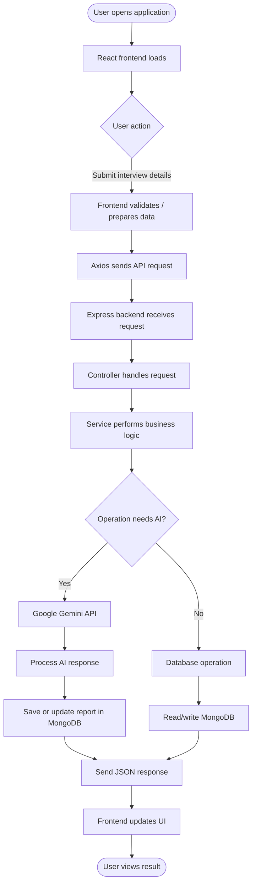
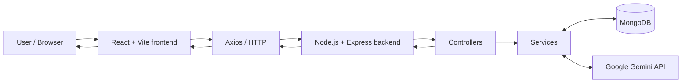
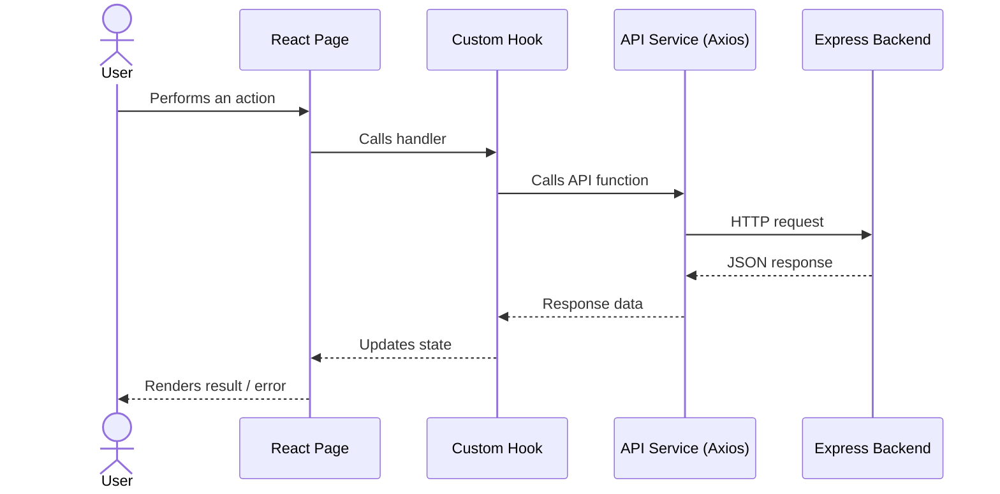
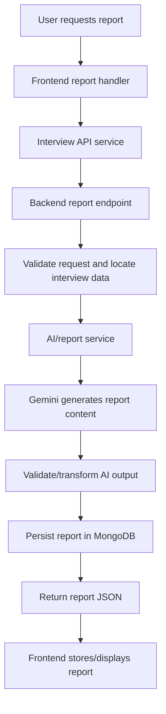
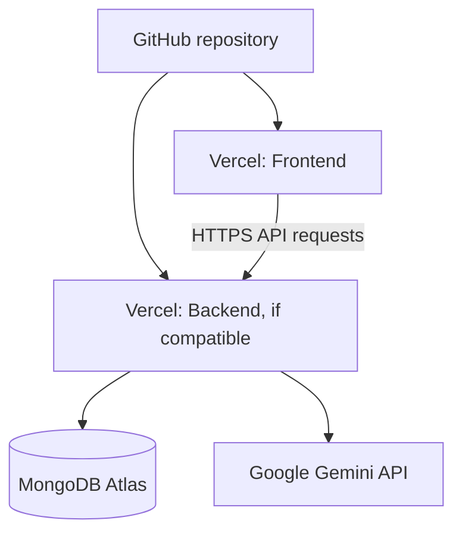

# Interview AI 🚀

An AI-powered interview preparation platform that helps candidates practice interviews and receive AI-generated feedback. The application uses a React frontend, a Node.js/Express backend, MongoDB for persistence, and Google Gemini for AI-powered processing.

> **Repository:** https://github.com/Singh-Devanand/Interview_Ai_Project

## Table of Contents

- [Overview](#-overview)
- [Core Workflow](#-core-workflow)
- [System Architecture](#-system-architecture)
- [Technology Stack](#-technology-stack)
- [Project Structure](#-project-structure)
- [Application Flow](#-application-flow)
- [Environment Variables](#-environment-variables)
- [Run Locally](#-run-locally)
- [API Integration](#-api-integration)
- [Deployment](#-deployment)
- [Troubleshooting](#-troubleshooting)
- [Future Improvements](#-future-improvements)

## 📌 Overview

Interview AI is a full-stack web application built to support interview preparation. The frontend provides the user interface, while the backend handles application logic, data operations, authentication (where configured), and AI-related requests.

The AI workflow uses the Google Gemini API to process interview-related information and generate a report. Interview data and reports are persisted through MongoDB.

### What the application does

- Provides a web interface for interview-related activities.
- Sends frontend requests to a REST API built with Express.
- Uses MongoDB to store and retrieve application data.
- Integrates Google Gemini for AI-powered processing.
- Retrieves interview reports through backend API services.

> Features and route names should be kept in sync with the implementation as the project evolves.

## 🔄 Core Workflow



## 🏗️ System Architecture



### Layer responsibilities

| Layer | Responsibility |
|---|---|
| Frontend | Renders pages and components, collects input, and displays results. |
| API client | Sends HTTP requests from the frontend to the backend. |
| Express routes | Maps an HTTP method and URL to a handler. |
| Controllers | Handle request/response flow and call the required logic. |
| Services | Encapsulate operations such as AI processing or report generation. |
| Models | Define MongoDB document structure through the project's data layer. |
| MongoDB | Persists users, interview data, and reports as implemented. |
| Gemini | Processes prompts and produces AI-generated output. |

## 🧰 Technology Stack

| Area | Technology | Purpose |
|---|---|---|
| Frontend | React | Component-based user interface |
| Frontend tooling | Vite | Local development and production build |
| HTTP client | Axios | Frontend-to-backend API communication |
| Backend | Node.js | JavaScript runtime |
| Backend framework | Express.js | REST API and request handling |
| Database | MongoDB | Persistent application data |
| AI integration | Google Gemini API | AI-powered interview processing |
| Configuration | dotenv | Loads backend environment variables |

The exact versions are defined in the respective `package.json` files.

## 📁 Project Structure

The repository uses separate frontend and backend applications. The outline below describes the main areas; verify names against the current source tree when files are renamed or added.

```text
Interview_Ai_Project/
│
├── Frontend/
│   ├── src/
│   │   ├── components/       # Reusable UI components
│   │   ├── pages/            # Screen/page components (e.g. Home)
│   │   ├── hooks/            # Reusable React logic (e.g. useInterview)
│   │   ├── services/         # API modules (e.g. interview.api)
│   │   ├── context/          # Shared application state, if present
│   │   ├── assets/           # Images, icons, and static assets
│   │   ├── App.jsx           # Root application component
│   │   └── main.jsx          # Vite/React entry point
│   ├── public/               # Public static files
│   ├── package.json          # Frontend dependencies and scripts
│   └── vite.config.js        # Vite configuration
│
├── Backend/
│   ├── src/
│   │   ├── config/           # Database and service configuration
│   │   ├── controllers/      # Request handlers
│   │   ├── routes/           # API route definitions
│   │   ├── models/           # MongoDB/Mongoose models
│   │   ├── services/         # AI and application business logic
│   │   ├── middlewares/      # Request middleware, if present
│   │   └── app.js            # Express app configuration, if present
│   ├── server.js             # Backend entry point (location may vary)
│   └── package.json          # Backend dependencies and scripts
│
├── .gitignore
└── README.md
```

### How to read the structure

- **`Frontend/src/pages`**: page-level UI, such as the home screen.
- **`Frontend/src/hooks`**: custom hooks that keep reusable stateful logic out of components. For example, an interview hook can call API functions and expose loading/result state.
- **`Frontend/src/services`**: central place for Axios/API functions. Components and hooks call these functions instead of duplicating request configuration.
- **`Backend/routes`**: declares API endpoints and connects them to controllers.
- **`Backend/controllers`**: reads request data, invokes services/models, and returns HTTP responses.
- **`Backend/services`**: contains operations that may involve Gemini or database access.
- **`Backend/models`**: defines the shape of documents stored in MongoDB.

## 🧭 Application Flow

### 1. Frontend request flow



A typical separation of responsibilities is:

1. The page handles the user interaction.
2. A custom hook manages the request and related UI state.
3. An API service sends the HTTP request.
4. The backend processes the request and returns JSON.
5. The hook updates state, and React re-renders the UI.

### 2. AI report flow



The exact prompt, schema, and persistence rules depend on the implementation in the backend. Keep this diagram aligned with the actual report-generation function.

## 🔐 Environment Variables

Create environment files locally; do not commit secrets.

### Backend

Create `Backend/.env` and add the variables used by your backend configuration. A typical setup may look like:

```env
PORT=3000
MONGODB_URI=your_mongodb_connection_string
GEMINI_API_KEY=your_gemini_api_key
JWT_SECRET=your_long_random_secret
```

Use the **exact variable names referenced in your source code**. If your code uses `MONGO_URI` instead of `MONGODB_URI`, keep that name.

### Frontend

Create `Frontend/.env` (or `.env.local`, according to your setup):

```env
VITE_API_URL=http://localhost:3000
```

Use the variable name expected by the Axios configuration in your frontend. Vite variables exposed to browser code must use the `VITE_` prefix and must never contain private API keys.

## 💻 Run Locally

### Prerequisites

- Node.js and npm
- MongoDB Atlas account or a local MongoDB instance
- Google Gemini API key (if using AI features)

### 1. Clone the repository

```bash
git clone https://github.com/Singh-Devanand/Interview_Ai_Project.git
cd Interview_Ai_Project
```

### 2. Install and start the backend

```bash
cd Backend
npm install
npm run dev
```

If the backend does not define a `dev` script, use the script listed in `Backend/package.json` (for example, `npm start`).

### 3. Install and start the frontend

Open another terminal:

```bash
cd Frontend
npm install
npm run dev
```

Open the local URL printed by Vite, commonly `http://localhost:5173`.

## 🔌 API Integration

The frontend API layer should keep request URLs in one place (for example, `Frontend/src/services/`). This makes it easier to change the backend base URL between local and production environments.

| Operation | Frontend layer | Backend responsibility |
|---|---|---|
| Generate interview report | Interview API service / hook | Generate or retrieve report |
| Get report by ID | Interview API service | Fetch a report by its identifier |
| Get all reports | Interview API service | Return the user's report collection |

> Add the exact HTTP methods, endpoint paths, authentication requirements, request bodies, and response examples from the backend route files before treating this table as a formal API reference.

## ☁️ Deployment

A common deployment arrangement is:



### Frontend on Vercel

1. Import the GitHub repository into Vercel.
2. Set the frontend root directory to `Frontend`.
3. Set the build command to `npm run build`.
4. Set the output directory to `dist` for Vite.
5. Add the production API base URL as a frontend environment variable (for example, `VITE_API_URL`).
6. Deploy and test the live URL.

### Backend deployment

The backend can be deployed on Vercel if its Express entry point and any required features are compatible with Vercel Functions. A conventional long-running server or persistent WebSocket server may need a hosting service designed for that workload.

Configure backend environment variables in the hosting dashboard, including the MongoDB connection string, Gemini key, JWT secret (if used), and allowed frontend origin. Never expose backend secrets in frontend variables.

After changing environment variables, redeploy where required.

## 🧯 Troubleshooting

| Symptom | Things to check |
|---|---|
| `Cannot read properties of null` while reading a report | Check whether the API returned `null`, whether the report exists, and whether the hook validates the response before accessing its fields. |
| `401 Unauthorized` | Check token/cookie handling, authentication middleware, and whether the user is logged in. |
| MongoDB `ECONNREFUSED` / DNS error | Verify the Atlas URI, network access rules, database credentials, and DNS configuration. |
| Gemini `404` model error | Verify the model identifier against the currently available Gemini models and the installed SDK version. |
| CORS error | Ensure the backend allows the exact deployed frontend origin and the required credentials. |
| API `404` | Check the route prefix, HTTP method, deployment rewrites, and frontend base URL. |
| Works locally but not in production | Confirm production environment variables, case-sensitive import paths, and deployment logs. |

## 🔮 Future Improvements

Potential improvements, depending on project goals:

- Add automated tests for API endpoints and report-generation logic.
- Add request validation and consistent error responses.
- Improve loading, empty, and failure states in the frontend.
- Document API schemas with OpenAPI/Swagger.
- Add structured logging and production monitoring.
- Add screenshots or a short demo GIF to help readers understand the UI.

## 👨‍💻 Author

**Devanand Singh**  
GitHub: [@Singh-Devanand](https://github.com/Singh-Devanand)

---

If you find this project useful, consider giving the repository a ⭐.


